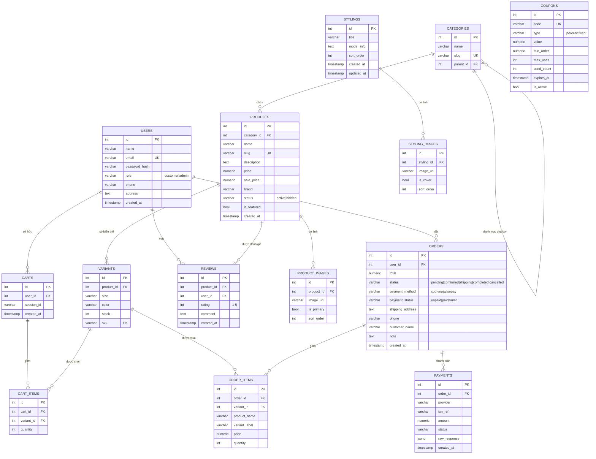
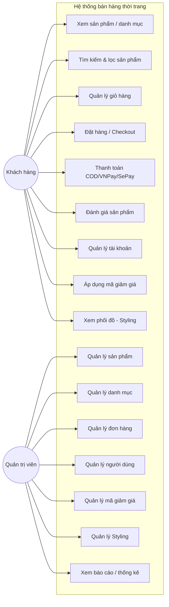
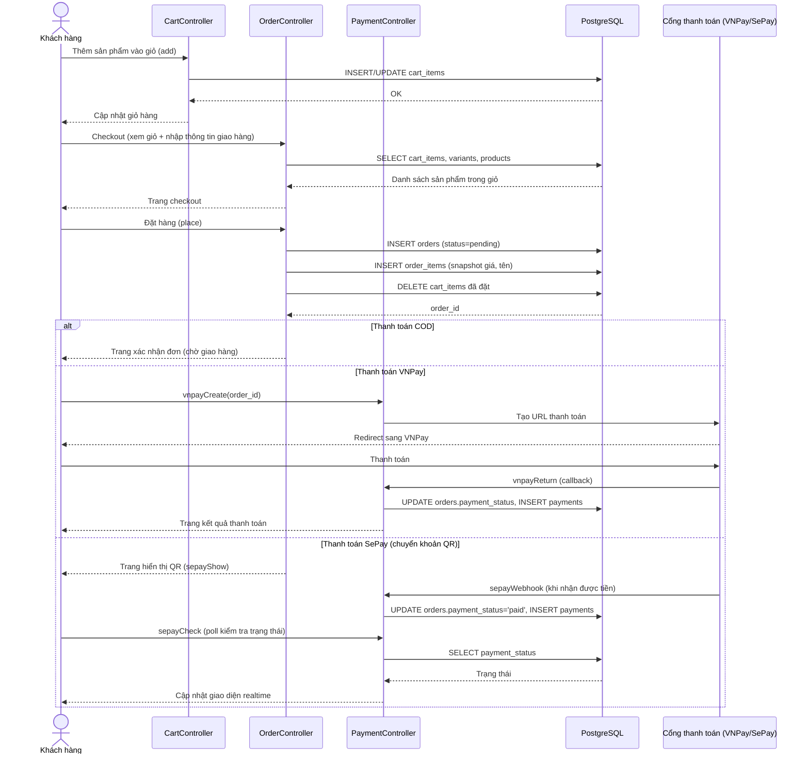
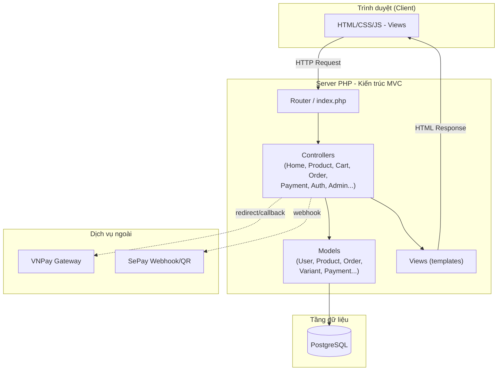
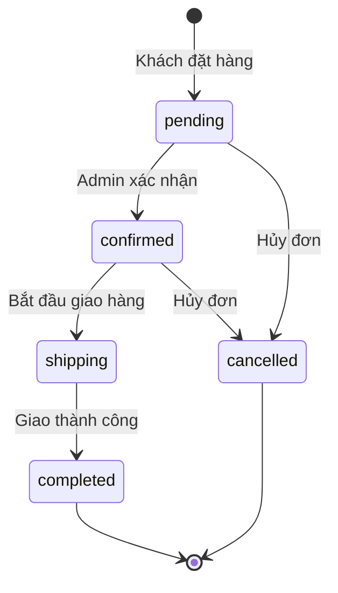

# Phân tích & Thiết kế hệ thống — Website bán hàng thời trang

## 1. ERD (Entity Relationship Diagram)

---

## 2. Use Case Diagram (tổng quan chức năng)

---

## 3. Sequence Diagram — Luồng đặt hàng & thanh toán

---

## 4. Kiến trúc hệ thống (MVC)

---

## 5. Trạng thái đơn hàng (State Diagram)

---

### Ghi chú khi thuyết trình
- **ERD**: nhấn mạnh quan hệ 1-n giữa `products` → `variants`/`product_images`, và việc `order_items` lưu **snapshot** (product_name, price) để không bị ảnh hưởng khi sản phẩm gốc thay đổi/xóa.
- **Sequence diagram**: làm rõ 3 phương thức thanh toán khác nhau (COD đơn giản, VNPay dùng redirect + callback, SePay dùng webhook + polling).
- **Kiến trúc MVC**: giải thích tách biệt Controller (xử lý logic), Model (truy vấn DB), View (giao diện).
